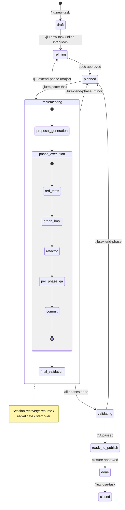
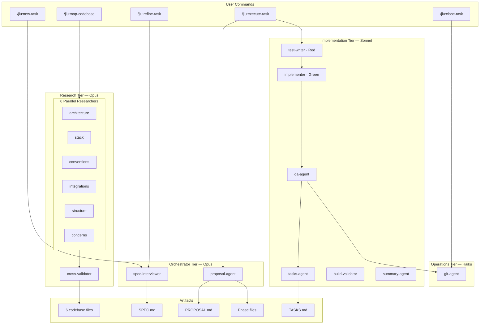

# Jelou Spec Plugin — Spec-Driven Development for Claude Code

A Claude Code plugin that implements Spec-Driven Development with specialized agents, strict TDD, multi-service orchestration, and a shared workspace as the single source of documentary truth.

Follows the conventions established by [OpenSpec](https://github.com/Fission-AI/OpenSpec) (`/opsx:`) and [Get Shit Done](https://github.com/gsd-build/get-shit-done) (`/gsd:`), with the **`/jlu:`** command namespace.

## What It Does

- **Spec-driven workflow**: Write a minimal spec, refine it through structured interview, generate an execution-ready proposal, and implement via TDD — all orchestrated by specialized agents.
- **Multi-service coordination**: Manages tasks that span multiple repos/services with dependency-driven execution, coordinated branches, and cross-service validation.
- **Agent specialization**: The orchestrator never writes code. It delegates to purpose-built agents (spec-interviewer, proposal, test-writer, implementer, QA) and consolidates their output.
- **Strict TDD**: Red → Green → Refactor enforced per phase. Separate test-writer and implementer agents ensure discipline.
- **Integrations**: ClickUp task management, Slack dailies (via MCP), Git worktree management, and PR coordination.

## Prerequisites

- [Claude Code CLI](https://docs.anthropic.com/en/docs/claude-code) installed and configured
- Git
- (Optional) ClickUp MCP server for task management integration
- (Optional) Slack MCP server for daily posts

## Quick Start

Inside a Claude Code session, run:

```
# 1. Register the marketplace (one-time)
/plugin marketplace add cristian-pisco/jelou-spec-plugin

# 2. Install the plugin
/plugin install jlu@jelou-spec-plugin
```

Then navigate to your project's parent directory and start using commands:

```
# Create a new task (will offer to set up .spec-workspace if missing)
/jlu:new-task

# (Optional) Map your codebase first
/jlu:map-codebase

# (Optional) ClickUp integration works automatically via MCP on first /jlu:sync-clickup
```

### Updating the Plugin

To pull the latest version inside a Claude Code session:

```
/plugin update jlu@jelou-spec-plugin
```

### Local Development / Manual Installation

```bash
# Option A: Load directly from a local directory
claude --plugin-dir /path/to/jelou-spec-plugin

# Option B: Fallback installer (copies skills/agents to ~/.claude/)
git clone https://github.com/cristian-pisco/jelou-spec-plugin.git
cd jelou-spec-plugin
./bin/install.sh
```

## Core Commands

| Command | Purpose |
|---------|---------|
| `/jlu:map-codebase` | Analyze a service and generate 6 codebase knowledge files |
| `/jlu:new-task` | Create a new task with spec, worktrees, and affected service detection |
| `/jlu:refine-task` | Apply a targeted change to an approved spec via structured interview |
| `/jlu:execute-task` | Run TDD implementation (autonomous or step-by-step mode) |
| `/jlu:extend-phase` | Add scope to an in-progress task via focused mini-interview |
| `/jlu:sync-clickup` | Create/update ClickUp macro task and subtasks via MCP |
| `/jlu:report-task` | Executive summary with progress, blockers, and stale worktree detection |
| `/jlu:load-context` | Load task context into a fresh session for Q&A |
| `/jlu:create-pr [task-slug]` | Stage, commit, push, and create pull requests for all affected services |
| `/jlu:post-slack [date] #channel` | Generate and post daily summary to Slack |
| `/jlu:close-task` | Close task after PR merge — updates ClickUp, artifacts, observability |
| `/jlu:refresh-skills` | Refresh the skill registry |

## Workspace Structure

The plugin uses `.spec-workspace/` in the parent directory of your services as the canonical root:

```
.spec-workspace/
  registry/
    services.yaml          # Service registry (id, path, stack)
  principles/
    ENGINEERING_PRINCIPLES.md
  services/
    <service-id>/
      codebase/            # 6 knowledge files per service
  specs/
    <dd-mm-yyyy>/
      <task-slug>/         # All task artifacts
        SPEC.md
        PROPOSAL.md
        TASKS.md
        services/
          <service-id>/
            CONTEXT.md
            phases/
            uh/
```

Each service repo only stores a minimal `.spec-workspace.json` pointer:

```json
{
  "workspace": "../.spec-workspace",
  "serviceId": "service-auth"
}
```

## Configuration

### ClickUp

ClickUp integration uses the ClickUp MCP server (no API key needed). On first run of `/jlu:sync-clickup`, you'll be prompted to select a target list. Field mappings are auto-discovered and persisted in `CLICKUP_TASK.json` per task.

### Slack

Requires a Slack MCP server configured in your Claude Code settings. The plugin generates message content; the MCP server handles delivery.

Channel templates can be customized in `.spec-workspace/registry/slack/<channel>.md`.

### Engineering Principles

Global principles in `.spec-workspace/principles/ENGINEERING_PRINCIPLES.md` (philosophical).
Per-service concrete rules in each service's `CONVENTIONS.md`.

## Documentation

- **[Full Specification](./JELOU_SPEC_PROPOSAL.md)** — Complete design decisions, artifact schemas, and interview transcript
- **[Architecture Diagrams](./docs/architecture.excalidraw)** — Editable diagrams (open with [excalidraw.com](https://excalidraw.com))

## How It Works (Simplified)

1. **Spec** → `/jlu:new-task` creates a seed, refines via inline interview, and sets up worktrees
2. **Proposal** → Two-pass generation (global strategy + per-service details)
3. **Execute** → Dependency-driven, TDD-enforced implementation with specialized agents
4. **Validate** → Continuous QA per phase + final cross-service validation
5. **Deliver** → Create PRs (`/jlu:create-pr`), sync to ClickUp, post to Slack

All state is file-based. No external database required.

## Task Lifecycle



## Agent Architecture



## Full Specification

See [JELOU_SPEC_PROPOSAL.md](./JELOU_SPEC_PROPOSAL.md) for the complete, implementation-ready specification including all design decisions, artifact schemas, and the full interview transcript.
