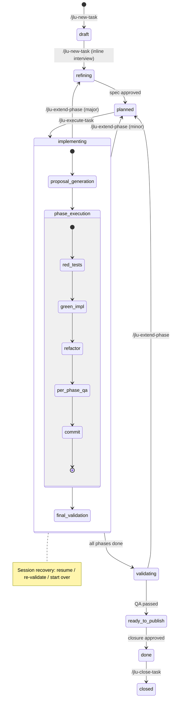
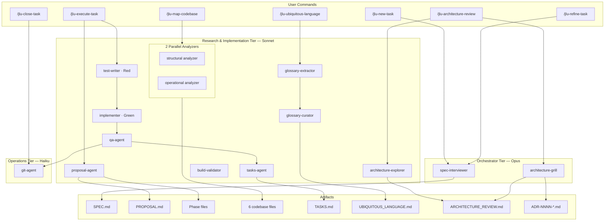

# Jelou Spec Plugin — Spec-Driven Development for Claude Code, OpenCode, and Codex

A spec-driven workflow plugin that runs on Claude Code, OpenCode, and Codex CLI with specialized agents, strict TDD, multi-service orchestration, and a shared workspace as the single source of documentary truth.

Follows the conventions established by [OpenSpec](https://github.com/Fission-AI/OpenSpec) (`/opsx:`) and [Get Shit Done](https://github.com/gsd-build/get-shit-done) (`/gsd:`), with the **`/jlu:`** namespace on Claude Code and **`/jlu-`** on OpenCode and Codex.

> Invocation reference: see [INVOCATION.md](./INVOCATION.md) for the full command list across all three runtimes.

**One spec, three runtimes.** The logic lives once in `jelou/workflows/*.md`; each runtime gets a thin generated shell — Claude Code skills (`skills/`), OpenCode commands (`.opencode/`), and Codex prompts + TOML subagents (`.codex/`, generated by `bin/sync-codex.mjs`). The same PreToolUse guards (worker-cap + `.env` hygiene) run on Claude Code (`hooks/hooks.json`), Codex (`.codex/hooks.json`, byte-identical hook contract), and OpenCode (`.opencode/plugins/guard.ts`, reusing the same classifiers).

## What It Does

- **Spec-driven workflow**: Write a minimal spec, refine it through structured interview, generate an execution-ready proposal, and implement via TDD — all orchestrated by specialized agents.
- **Multi-service coordination**: Manages tasks that span multiple repos/services with dependency-driven execution, coordinated branches, and cross-service validation.
- **Agent specialization**: The orchestrator never writes code. It delegates to purpose-built agents (spec-interviewer, proposal, test-writer, implementer, QA) and consolidates their output.
- **Strict TDD**: Red → Green → Refactor enforced per phase. Separate test-writer and implementer agents ensure discipline.
- **Integrations**: Git worktree management and PR coordination in Phase 1; ClickUp and Slack MCP integrations in Phase 2.
- **Ubiquitous language**: `/jlu-ubiquitous-language` discovers and curates the workspace's domain glossary across services, anchoring each term to the services where it's implemented and referenced.
- **Architecture review**: `/jlu-architecture-review` surfaces deepening opportunities (single-service or cross-service) — refactors that turn shallow modules into deep ones — runs an interactive grilling loop on a chosen candidate, and lazily records ADRs when candidates are rejected with load-bearing reasons.
- **Dev environment diagnose**: `/jlu-diagnose` reads recent failure events and a TMUX pane capture from your dev environment, dispatches a focused diagnoser agent to triage the failure, and proposes a structured fix (host or container) that you confirm before it runs. Failure patterns can be registered with `/jlu-add-failure-pattern` so the daemon picks them up on the next match.
- **PR resolution**: `/jlu-resolve-pr` drives the current branch's pull request(s) to green — merge conflicts with the base branch, review threads (humans and bots like CodeRabbit), failing CI jobs, and, when the repo uses SonarQube, a gated quality phase that clusters issues by root cause. Runs interactively by default or unattended with `--autonomous`, where every judgment call escalates instead of applying.
- **Autochain (full autonomy from interview to green PRs)**: `/jlu-new-task` and `/jlu-refine-task` create-or-bind the ClickUp task at SPEC approval (always, non-blocking); the autochain is **on by default** (no configuration required), so they hand off inline into `/jlu-execute-task`; after final QA green, execute-task ships inline and dispatches a `jlu-resolve-pr-runner` per open PR (sequentially) to drive review threads, CI, and Sonar to green. Task-green is the AND of every PR verdict, progress persists in the task's `AUTOCHAIN.json` (a dead session re-enters where it stopped), and when green the ClickUp status flips to `PENDING TO PRODUCTION`. Pass a ClickUp URL or id inline on any of the three commands to bind an existing task. Opting out: `--no-autochain` for one invocation, `JLU_AUTOCHAIN=false` for a session, or `{"autochain": false}` in `~/.jlu/settings.json` as the standing kill-switch.
- **Tracing, evaluation & observability**: Plugin-native JSONL span store at `<WORKSPACE>/.traces/spans.jsonl` that traces every workflow/phase/agent-dispatch, evaluates the quality of what they produced, and turns the evidence into verifiable improvement suggestions — the full **TRACE → EVALUATE → ANALYZE → IMPROVE → VERIFY** loop. Captures token/cost and `pass@1`/`pass@k` task-success, scores outputs with a cross-family LLM-judge (calibrated against harvested accept/reject feedback), exports to OpenInference/OTel for Phoenix/Langfuse/Datadog, and gates prompt changes with a golden-set regression check. ULID-based, payload-capped under `PIPE_BUF` for atomic appends; `TRACE_DISABLED=1` / `EVAL_DISABLED=1` short-circuit emission and judging. See [Tracing & Observability](#tracing--observability).

## Prerequisites

- [OpenCode CLI](https://opencode.ai/docs/) or [Claude Code CLI](https://docs.anthropic.com/en/docs/claude-code)
- Git
- (Phase 2) ClickUp MCP server for task management integration
- (Phase 2) Slack MCP server for daily posts

## Installation (one command)

Install into every AI CLI detected on your machine (Claude Code, OpenCode, Codex):

```bash
curl -fsSL https://raw.githubusercontent.com/cristian-pisco/jelou-spec-plugin/main/install.sh | bash
```

Restrict to one tool, or pin a released version:

```bash
# Codex only
curl -fsSL https://raw.githubusercontent.com/cristian-pisco/jelou-spec-plugin/main/install.sh | bash -s -- --host codex

# Pin a tag
curl -fsSL https://raw.githubusercontent.com/cristian-pisco/jelou-spec-plugin/main/install.sh | bash -s -- --ref v0.3.235
```

The installer clones the plugin to `~/.jelou-spec-plugin` (override with `JLU_HOME`) and runs `./setup`. Re-run the same command anytime to update.

### Updating (any runtime)

Run `/jlu-update` from inside any runtime — Claude Code, Codex, or OpenCode. It pulls the
shared `~/.jelou-spec-plugin` git cache to the latest release, or the updater's own git
checkout when no shared cache exists. If neither exists on Codex/OpenCode, it bootstraps
`~/.jelou-spec-plugin` automatically before reinstalling for the runtime you ran it from,
printing `vOLD -> vNEW`. Pin a version with `/jlu-update --ref v0.3.235`.

This is the primary update path for Codex and OpenCode, which have no built-in plugin
update. Claude Code also supports its native marketplace path (`/plugin update
jlu@jelou-spec-plugin`); `/jlu-update` from Claude refreshes a cache-based install or, if
there is no cache, points you back to the marketplace command.

### From source (development)

```bash
git clone https://github.com/cristian-pisco/jelou-spec-plugin.git
cd jelou-spec-plugin
./setup            # or: ./setup --host claude --host opencode --host codex

# Install into a specific OpenCode/Codex project
./setup --host opencode --project /path/to/your-project
bin/install-codex.sh /path/to/your-project
```

### Advanced: native marketplaces

Claude Code and Codex can also install via their own marketplaces:

```bash
# Claude Code
claude plugin marketplace add cristian-pisco/jelou-spec-plugin
claude plugin install jlu@jelou-spec-plugin

# Codex
codex plugin marketplace add cristian-pisco/jelou-spec-plugin   # then pick via /plugins
```

OpenCode has no marketplace — use the one-liner above.

## Quick Start (OpenCode)

Run OpenCode from this repository root:

```bash
opencode
```

Use the command palette with the `jlu-` namespace:

```
# Create a new task (will offer to set up .spec-workspace if missing)
/jlu-new-task

# (Optional) Map your codebase first
/jlu-map-codebase

# Surface refactor candidates for a service (or --cross-service across all of them)
/jlu-architecture-review <service-id>

# Diagnose a failing service in your TMUX dev environment
/jlu-diagnose <service-id>
```

OpenCode also accepts bare `jlu-*` input (without slash). Example: `jlu-load-context` is normalized to `/jlu-load-context`.

Workflow resolution in OpenCode is global-first: commands load from `~/.config/opencode/jelou/...` before checking project-local fallbacks.

## Install in an Existing OpenCode Project

Automatic install (recommended):

```bash
# from this plugin repo (preferred)
./setup --host opencode --project /path/to/your-project
```

Legacy equivalent:

```bash
./bin/install-opencode.sh /path/to/your-project
```

What it does automatically:
- Copies `.opencode/` into the target project
- Copies `jelou/` workflows/templates/references into the target project
- Injects/updates a managed Jelou block in the target `AGENTS.md` (idempotent)

Manual install (if you prefer):

```bash
# from your target project root
cp -R /path/to/jelou-spec-plugin/.opencode ./
cp -R /path/to/jelou-spec-plugin/jelou ./
```

After that, start OpenCode in the target repo and run:

```bash
opencode
```

Use commands like `/jlu-new-task`, `/jlu-execute-task`, `/jlu-ship`, `/jlu-ubiquitous-language` (or bare `jlu-new-task`, `jlu-execute-task`, etc.).

### Update in Existing Project

Run the same setup command again:

```bash
git pull
./setup --host opencode --project /path/to/your-project
```

### Quick Start (Claude Code)

Inside a Claude Code session, run:

```
# 1. Register the marketplace (one-time)
/plugin marketplace add cristian-pisco/jelou-spec-plugin

# 2. Install the plugin
/plugin install jlu@jelou-spec-plugin
```

### Updating the Claude Plugin

To pull the latest version inside a Claude Code session:

```
/plugin update jlu@jelou-spec-plugin
```

The plugin silently checks for updates when you run any `/jlu-*` command. If a newer version exists, you'll see a one-line notice with the update command. Checks are cached for 4 hours and skip in CI environments.

### Local Development / Manual Installation (Claude)

```bash
# Option A: Load directly from a local directory
claude --plugin-dir /path/to/jelou-spec-plugin

# Option B: Fallback installer (same behavior as ./setup --host claude)
git clone https://github.com/cristian-pisco/jelou-spec-plugin.git
cd jelou-spec-plugin
./setup --host claude
```

## Quick Start (Codex)

```bash
git clone https://github.com/cristian-pisco/jelou-spec-plugin.git
cd jelou-spec-plugin
./setup --host codex          # installs prompts/agents/workflows/guards into ~/.codex
```

Then in Codex, the commands are the same hyphen-prefixed names as OpenCode:

```
/jlu-new-task add user authentication
/jlu-map-codebase service-auth
/jlu-execute-task add-user-auth
/jlu-ship
```

Use the slash form in Codex. If a bare command such as `jlu-load-context` is entered,
the installed `AGENTS.md` fallback treats it as the matching prompt; if Codex says it
is not on `PATH`, the Codex install is not loaded. Re-run `./setup --host codex`
or use `bin/install-codex.sh <project>` for a project-local install, then restart
Codex in the target repo.

Codex specifics (see [jelou/references/codex-runtime.md](./jelou/references/codex-runtime.md)):

- **Prompts + subagents are generated** from `skills/` and `agents/` by `bin/sync-codex.mjs` (CI enforces sync). Edit the canonical sources, then `npm run sync`.
- **`question` degrades gracefully**: Codex has no structured question widget, so interview steps are asked as plain-text numbered prompts that wait for your reply.
- **Subagent depth is capped** (`agents.max_depth = 1`): the orchestrator dispatches workers; workers don't re-dispatch. Parallel fan-out across services uses `agents.max_threads`.
- **Guards are reused verbatim** via `.codex/hooks.json` — Codex's PreToolUse hook contract (`tool_name`/`tool_input.command` in, `permissionDecision` out) matches Claude Code's exactly.
- **Context window stays visible**: the Codex installer ensures `tui.status_line` includes `context-remaining`, preserving your existing footer items when possible.
- **Trust the project** so its `.codex/` layer loads: add `[projects."<abs-path>"] trust_level = "trusted"` to `~/.codex/config.toml`. Note that Codex's project layer cannot set `model`/`sandbox_mode`/`approval_policy` (machine-local by design).

## Core Commands

OpenCode command definitions live in `.opencode/commands/`. All commands use the `jlu-` namespace.

| Command | Purpose |
|---------|---------|
| `/jlu-map-codebase` | Analyze a service with 2 parallel agents, generate 6 codebase knowledge files, auto-register the service in `services.yaml` |
| `/jlu-ubiquitous-language [service-id]` | Curate the workspace's domain glossary; extract terms from code + spec/interview artifacts; review-then-save loop |
| `/jlu-new-task [desc] [clickup-url\|id] [--no-autochain]` | Create a new task with spec, worktrees, and affected service detection. Creates/binds the ClickUp task at SPEC approval (non-blocking); with `autochain` on, chains inline into `/jlu-execute-task` |
| `/jlu-refine-task [change-desc] [clickup-url\|id] [--no-autochain]` | Apply a targeted change to an approved spec via structured interview. Re-syncs ClickUp (non-blocking); with `autochain` on, re-enters `/jlu-execute-task` when phases changed |
| `/jlu-execute-task [slug] [clickup-url\|id] [--no-autochain]` | Run TDD implementation with CPU-safe defaults (sequential by default; opt-in parallelism). With `autochain` on, after final QA green it runs `/jlu-ship` inline and drives every open PR to green via `jlu-resolve-pr-runner`, resumable from `AUTOCHAIN.json` |
| `/jlu-extend-phase` | Add scope to an in-progress task via focused mini-interview |
| `/jlu-task-clickup` | (Phase 2) Create/update ClickUp macro task and subtasks via MCP |
| `/jlu-report-task` | Executive summary with progress, blockers, and stale worktree detection |
| `/jlu-list-tasks [--status <state>] [--sprint <n>]` | List every local task created by `/jlu-new-task` — table of slug, title, lifecycle state, date, sprint, and affected services |
| `/jlu-load-context` | Load task context into a fresh session for Q&A |
| `/jlu-council` | Convene a multi-model jury on an architecture idea — categorical `GO / GO_WITH_CONDITIONS / NO_GO` verdict with dissent preserved (Claude Code skill; OpenCode parity planned) |
| `/jlu-ship [task-slug]` | Stage, commit, push, and create pull requests for all affected services. Before opening PRs, validates that each service installs deps cleanly and builds — in-container for docker-compose services. `/jlu-create-pr` is a deprecated alias. |
| `/jlu-resolve-pr [pr-url\|pr-number] [--autonomous]` | Drive the current branch's PR(s) to green: merge conflicts, review threads (CodeRabbit and other bots first-class), failing CI jobs, and a gated SonarQube phase — issues clustered by root cause, mechanical fixes auto-applied, structural refactors planned for approval, security hotspots never auto-resolved. `--autonomous` never prompts: every ask-path resolves to skip, rerun, or escalate. |
| `/jlu-daily-slack <sprint> #channel` | Generate and post a sprint-scoped daily summary to a Slack channel |
| `/jlu-close-task` | Close task after PR merge — updates ClickUp, cleans worktrees |
| `/jlu-rollback-phase` | Reset service worktrees to the last known-good phase state |
| `/jlu-diagnose [name]` | Analyze a failing dev-environment service (TMUX pane + recent events) and propose a structured fix (host or container) |
| `/jlu-architecture-review [<service-id>] [--cross-service]` | Surface deepening opportunities (single-service or cross-service); interactive grilling loop; lazy ADRs |
| `/jlu-goal [goal matrix]` | Run a user-supplied goal matrix to green against the full local stack — each objective (frontend/backend/fullstack) compiles to E2E suites, the dev infra boots once, and a bounded convergence loop (run → auto-fix → re-run) ends only when every objective is green, with mandatory video evidence for frontend/fullstack objectives. `/jlu-production-like` is a deprecated alias. The single QA entry point for a finished task. |
| `/jlu-trace-report` | Query the workspace trace store: by-agent / by-phase / by-task / trends |
| `/jlu-eval-report` | Consolidated evaluation scorecard: task success, cost-per-task, per-agent quality, calibration, failure taxonomy, suggestion hit-rate |
| `/jlu-investigate "<question>" [--engine perplexity\|fusion]` | Stateful research/decision command. Runs one engine per call (default Perplexity; OpenRouter Fusion via `--engine fusion`), persists each investigation as a resumable Obsidian note (local-file fallback), resumes by topic slug. Not a debugger — use `/jlu-diagnose` for failures. |
| `/jlu-update [--ref <ref>]` | Update the plugin to the latest version for the current runtime — pulls or bootstraps the shared `~/.jelou-spec-plugin` git cache, or uses the updater's own checkout, and reinstalls. Primary update path for Codex and OpenCode. |

### Test execution model

The plugin splits test responsibilities to keep the local TDD loop fast and the regression net robust:

| Stage | Who runs it | What runs |
|-------|-------------|-----------|
| Per-phase (TDD inner loop) | Sub-agents (`jlu-test-writer`, `jlu-implementer`, `jlu-tdd-cycle`, `jlu-refactor-agent`) | Only the test files for the current phase |
| Step 8b (regression check at end of task) | Orchestrator (no agent, just `Bash`) | **Affected tests only** — `jest --findRelatedTests` / `vitest related` / `pytest --picked` / `go test -p 2` against changed packages. Workers capped at 2. |
| Pre-PR (developer's call) | `/jlu-test-suite` skill | Full unit + integration of the current service. Workers fixed at 1. Failures grouped by component. |
| CI on push | GitHub Actions (or equivalent) | Full suite with whatever your CI declares |

The orchestrator never runs the full suite. That responsibility belongs to `/jlu-test-suite` (local on-demand) and CI (on push). This split is what prevents "full test + comprehensive QA" from swap-thrashing developer machines.

### Test Suite — Pre-PR Validation

`/jlu-test-suite` is the developer-invoked counterpart to Step 8b's affected-tests check. It runs the current service's full unit + integration suites under a strict 1-worker cap, then groups failures by the component under test so the dev can see at a glance whether the regressions concentrate in a Service, a Repository, a Controller, etc.

**When to use it**

| Scenario | Use `/jlu-test-suite`? |
|----------|------------------------|
| About to open a PR and want a richer signal than Step 8b's affected subset | **Yes** |
| Step 8b reported `SKIPPED` (mocha, plugin-less pytest, only config files changed) | **Yes** — Step 8c's QA agent will explicitly recommend it |
| You suspect a cross-cutting change (helper, type, base class) and want belt-and-suspenders | **Yes** |
| Tests are slow and you're in the middle of TDD on a single phase | **No** — keep using the per-phase agents' targeted runs |
| You want coverage numbers | **No** — coverage is CI's job; this skill never runs `--coverage` |

**Invocation**

```bash
/jlu-test-suite
```

No arguments. By design — the workers-fixed-at-1 contract can't be loosened, and the service is resolved from cwd. If you need to validate a different service, `cd` into it first.

**What it does (in order)**

1. Walks up from cwd looking for `.spec-workspace/` (max 5 levels). Resolves the service via longest-prefix match against `services.yaml`.
2. Honors active task worktrees: if you're on `production/<slug>` or `staging/<slug>` and `TASKS.md` declares `Mode: worktree`, runs against `<repo>/.worktrees/<slug>/`. Otherwise the main repo.
3. Lightweight pre-flight: aborts only on truly degraded machines (< 1.5 GB available RAM). Workers=1 means the normal threshold is generous.
4. Detects the runner from CONVENTIONS.md's "Test Filtering Commands" table (populated by `/jlu-map-codebase`), with manifest-introspection fallback. Supports **Jest, Vitest, Mocha, pytest** (+ `pytest-xdist` / `pytest-json-report` when present), and **Go**.
5. Runs unit tests first, then integration tests (only if CONVENTIONS.md declares them as a separate command). Worker cap is injected per runner: `--runInBand` (Jest), `--pool=threads --poolOptions.threads.maxThreads=1` (Vitest), `-n 1` (pytest-xdist), `-p 1` (Go).
6. **If everything is green** — prints a one-line pass summary and exits 0.
7. **If anything failed** — parses the runner's JSON output (or falls back to stdout), reads each failing test file, identifies the symbol under test from imports and the `describe(...)` subject, and classifies it by suffix:

   | Basename suffix | Component type |
   |-----------------|----------------|
   | `*.controller.{ts,js,py}` | Controller |
   | `*.service.{ts,js,py}` | Service |
   | `*.repository.{ts,js,py}`, `*.repo.{ts,js}` | Repository |
   | `*.middleware.{ts,js}` | Middleware |
   | `*.guard.{ts,js}`, `*.interceptor.{ts,js}`, `*.pipe.{ts,js}`, `*.filter.{ts,js}` | Guard/Interceptor |
   | `*.dto.{ts,js}`, `*.entity.{ts,js}`, `*.schema.{ts,js}`, `*.model.{ts,js,py}` | DTO/Entity |
   | `*.handler.{ts,js,go}`, `*.command.{ts,js}`, `*.query.{ts,js}` | Handler |
   | `*.util.{ts,js,py}`, `*.helper.{ts,js,py}` | Util |
   | Anything else | Module |

   CONVENTIONS.md can override these defaults via its `## Naming Conventions` section.

**Sample success output**

```
## Test Suite — PASS

- Unit: 142/142 passing
- Integration: 38/38 passing
- Runner: jest, workers: 1
- Effective path: /home/cris/jelou/jelou-api/.worktrees/add-oauth-flow/
```

**Sample failure output**

```
## Test Suite — FAIL (3 unit · 1 integration)

### AuthService (src/auth/auth.service.ts) — 2 failures — Service
✗ verifyToken rejects expired tokens
  src/auth/__tests__/auth.service.spec.ts:42
  Expected status 401; received 500

✗ parseClaims returns null for malformed payload
  src/auth/__tests__/auth.service.spec.ts:67
  Expected: null; Received: undefined

### UsersController (src/users/users.controller.ts) — 1 failure — Controller
✗ GET /users/:id returns 404 for missing user
  src/users/__tests__/users.controller.spec.ts:88
  Expected status 404; Received 500

### AuthFlowIntegration (test/integration/auth.spec.ts) — 1 failure — Module
✗ login → token → /me happy path
  test/integration/auth.spec.ts:23
  Connection refused: postgres://localhost:5432
  ↪ Dev infrastructure appears unreachable. Did you run /jlu-start-dev?

### Summary
- Unit:        142/144 passing · 2 failing
- Integration: 37/38 passing  · 1 failing
- Components with failures: Service, Controller, Module
- Effective path: /home/cris/jelou/jelou-api
- Workers: 1
```

The "Did you run /jlu-start-dev?" hint is automatic — any error matching `ECONNREFUSED`, `connection refused`, `Pool exhausted`, `getaddrinfo ENOTFOUND`, `connect timeout`, or `MongoServerSelectionError` triggers it under the failing test.

**Exit codes**

| Code | Meaning |
|------|---------|
| 0 | All tests green |
| 1 | One or more tests failed (report rendered) |
| 2 | Pre-flight RAM gate aborted |
| 3 | Test runner could not be detected — add a "Test Filtering Commands" table to CONVENTIONS.md or a `test` script to your manifest |

**Limitations (V1)**

- **Single-service.** To validate multiple services in one task, invoke once per service from each `cd`. V2 may add `--all-affected` reading TASKS.md.
- **Workers fixed at 1.** No env var override, by design. If you need parallelism, run the underlying runner directly.
- **No coverage.** Coverage runs roughly double RAM per worker and belong in CI. Step 8c reads existing coverage reports if present but never generates them.
- **No auto-fix.** This skill validates and reports. Fixes are the developer's call. (Step 8b dispatches `jlu-implementer` on failure; `/jlu-test-suite` deliberately does not.)
- **Classification is best-effort.** Suffix-based heuristics + CONVENTIONS.md overrides. Projects with non-standard naming may see "Module" fallbacks on tests the classifier can't pin down.

**Best results in Sonnet+**

Step 7 (the failure-classification step) reads test files and infers component types from imports. Haiku can produce underspecific classifications on projects with non-standard naming. If you're already in Sonnet or Opus, no action needed. To override:

```json
// .spec-workspace.json
{ "models": { "code": "sonnet" } }
```

### Investigate — stateful research

`/jlu-investigate` runs a research engine, records the answer with its sources, and
persists the investigation as a note you can resume later. It never invents a fact: an
answer without sources is flagged unverified.

**New investigation** (default engine: Perplexity)

```bash
/jlu-investigate "¿Conviene migrar el api-gateway de REST a gRPC?"
```

**Use Fusion** (OpenRouter multi-model deliberation)

```bash
/jlu-investigate "¿gRPC vs REST a escala?" --engine fusion
```

**Resume** — invoking the same topic appends a new round to the existing note

```bash
/jlu-investigate "¿gRPC vs REST a escala?" --engine fusion
```

Notes live in Obsidian at `Resources/Investigations/<slug>.md` (or `./investigations/<slug>.md`
when the `obs` wrapper is unavailable). Each round records which engine ran, so comparing
Fusion vs Perplexity happens across your corpus of notes over time. Close an investigation by
setting `status: closed` in its frontmatter.

### Resource knobs

| Env var | Default | Effect |
|---------|---------|--------|
| `JLU_PHASE_PARALLELISM` | `1` | Concurrent agent fan-out per phase AND per-task (proposal-agent multi-service, codebase analyzers, Step 8b across services). Bump only if your box has headroom. |
| `JLU_FINAL_TEST_PARALLELISM` | — | **Deprecated.** No longer read — the orchestrator no longer runs the full suite. |
| `JLU_TEST_MAX_WORKERS` | — | **Deprecated.** Step 8b is fixed at 2 workers; `/jlu-test-suite` is fixed at 1. |

### Spec Compliance Review

When creating a PR via `/jlu-ship`, a spec compliance review runs automatically:
- Checks every SPEC.md requirement against the actual code diff
- Reports COVERED / MISSING / UNTESTED status with file:line evidence
- Detects scope creep (code changes not in the spec)
- Includes the report in the PR description for human reviewers

### Dual-PR Tasks

Tasks opting into dual-PR (via the `/jlu-new-task` prompt "Also create a PR to `alpha`?") produce **two** PRs on `/jlu-ship`:

- `production/<slug>` → trunk (the mandatory primary PR)
- `staging/<slug>` → `alpha` (created up-front by `/jlu-new-task`: cut from `origin/alpha` and pushed; production commits are cherry-picked on top at `/jlu-ship` by the `jlu-conflict-resolver` sub-agent — reused when `alpha` is unchanged, rebuilt from fresh `origin/alpha` when it moved)

`/jlu-new-task` always derives `<slug>` with English semantic words, regardless of the language used in the task description, while preserving technical identifiers and product names.

If the conflict resolver cannot resolve a merge conflict with confidence, the staging side aborts cleanly and offers the user three options: resolve manually, disable dual-PR, or abort.

### Spec Templates

The interview automatically detects which domains your task involves and applies matching templates:

- **REST API Endpoint** — request/response schema, validation, auth, rate limits
- **UI Component** — states, interactions, accessibility, responsive behavior
- **Database Migration** — schema changes, rollback strategy, zero-downtime
- **Event Consumer** — idempotency, retry logic, dead letter handling

Cross-cutting tasks (e.g., API + migration + events) get all relevant templates merged automatically. No manual selection needed.

Custom templates can be added to `<WORKSPACE_PATH>/templates/`.

## UI QA — Spec-driven E2E Testing

For tasks that touch a UI service, jelou-spec-plugin generates failing Playwright tests during the RED phase from a `user-flow.md` block in `SPEC.md`, and runs them post-deploy under a bounded auto-fix loop.

| Phase | Command / Agent | What happens |
|---|---|---|
| **RED** (during `/jlu-execute-task`) | `jlu-ui-e2e-writer` agent | Reads `user-flow.md` blocks, emits failing Playwright tests under `.spec-workspace/specs/<task>/services/<ui-service>/e2e/`. Role-based locators by default; refuses to invent `data-testid` selectors not declared in `selectors.md`. |
| **GREEN** (during `/jlu-execute-task`) | `jlu-implementer` (existing) | Writes UI source code to make the tests pass. |
| **VERIFY** (post-deploy, user-triggered) | `/jlu-ui-qa-run [task-slug]` | Boots only the services in `affected_services`, runs Playwright headless (default 1 worker; guarded scale-up), dispatches `jlu-ui-fix-loop` on failure with hard bounds (3 attempts/assertion, 15-min suite circuit-breaker). |
| **RECOVER** (after a crashed run) | `/jlu-ui-qa-cleanup` | Frees stale dev servers, containers, ports, and lock files. |

Each E2E-targeted service must declare a `dev` block in `services.yaml` (launcher, command, readiness signal, RAM estimate, data isolation). See [`jelou/references/dev-block-schema.md`](./jelou/references/dev-block-schema.md). Services without a `dev` block are skipped here — though `/jlu-map-codebase` now derives and boot-certifies missing blocks at mapping time, so mapped services normally arrive with one.

Trace summaries (`trace-summary.json` + screenshots) are committed; raw `trace.zip` is gitignored.

## Goal — Run a Goal Matrix to Green (Full-Stack QA Orchestration)

`/jlu-goal` (formerly `/jlu-production-like`, kept as a deprecated alias) runs a user-supplied **goal matrix** to green against a live, production-shaped stack in one command. Each objective declares its level — `frontend`, `backend`, or `fullstack` — and compiles into tagged E2E suites (`SPEC.md` is context for the derivation; the matrix governs the verdict). The workflow boots the dev infrastructure **once**, fans out to the right runners, then runs a bounded **convergence loop**: execute the matrix → for each red objective, delegate a fix (`jlu-implementer` for backend, the runner's `jlu-ui-fix-loop` for UI) → re-run its tagged suite — until every objective is green or `--max-iterations` (default 3) is exhausted. Then it tears everything down.

The orchestrator is **thin**: it owns only the goal-matrix brokering (parse, disambiguation interview, `GOALS.md` persistence, loop bookkeeping), the dev-environment lifecycle (boot once / teardown), the OTP auth gate (session-bound), brokering any runner's `NEEDS_CONTEXT` via a question, dispatch/routing, and result aggregation. All execution, authoring, and fixing is delegated to subagents — it never runs a test, writes a `.spec.ts`, or applies a fix itself.

| Objective level | Runners dispatched | What runs |
|---|---|---|
| **frontend** | `jlu-ui-qa-runner` | UI Playwright suite scoped to the objective's `@goal:G<id>` tag (reuse-or-reboot frontend) |
| **backend** | `jlu-test-suite-runner` + `jlu-backend-e2e-runner` | Backend unit/integration suite + Testcontainers backend-E2E (`[G<id>]`-tagged, dependencies-only, real HTTP) |
| **fullstack** | all three | Both sides — the objective is green only when both pass |

**Video evidence is mandatory for frontend and fullstack objectives**: every run records via the `JLU_E2E_VIDEO` contract (pass AND fail), and the final report maps each objective to its video path(s) — a frontend/fullstack objective without a video artifact is not reportable as green. Backend-only objectives need no video. The resolved matrix persists to `$TASK_DIR/GOALS.md` with per-objective statuses, so a later `/jlu-goal` with no argument resumes with only the reds. Invoke before opening the PR, after `/jlu-execute-task` is green.

```bash
/jlu-goal "crear un producto y verlo en la lista [fullstack] @brain-ui; el POST persiste en Mongo [backend] @products-api"
/jlu-goal '[{"title":"checkout completes","level":"fullstack","services":["shop-ui","orders-api"]}]' --max-iterations=5
/jlu-goal                 # resume the persisted GOALS.md (auto-detect the task from the current branch)
/jlu-goal --task=add-oauth-flow   # explicit task slug
```

## Architecture Review — Deepening Opportunities

`/jlu-architecture-review` is a standalone exploration tool that surfaces refactor candidates in a service or across services. It does not write code; it produces refactor *briefs* that feed `/jlu-new-task` and *ADRs* that prevent the same candidate from being re-suggested on the next run.

| Mode | Command | What happens |
|---|---|---|
| **Single service** | `/jlu-architecture-review <service-id>` | Reads the 6 codebase knowledge files, the canonical glossary (read-only), and any existing ADRs scoped to that service. Walks the source via `Explore` sub-agents. Emits up to 7 numbered candidates. |
| **Cross-service** | `/jlu-architecture-review --cross-service [<service-id>]` | Same shape, but joins multiple services and prioritizes friction at integration points (the "Remote but owned" / Ports & Adapters case). |

After the candidate list is rendered, the orchestrator hands the selected candidate to a grilling agent (Opus) that walks the design tree with the user — bounded to ~6 questions — and produces one of three outcomes per candidate:

- **Survives** → refined brief appended to the report; copy-paste ready for `/jlu-new-task`.
- **Rejected with load-bearing reason** → ADR written to `<workspace>/decisions/ADR-NNNN-<slug>.md`.
- **Rejected casually** → one-line note in the report.

Two key vocabularies stay distinct. **Architecture vocabulary** (Module, Interface, Seam, Adapter, Depth, Leverage, Locality — see [`jelou/references/architecture-language.md`](./jelou/references/architecture-language.md)) is enforced in candidate text and ADRs. **Domain vocabulary** comes from `<workspace>/glossary/UBIQUITOUS_LANGUAGE.md` (read-only); candidates name the concept (e.g. "the Order intake module"), never invented terms like "OrderHandler". If a concept isn't yet in the glossary, the candidate carries `missing_domain_term` and the final summary recommends running `/jlu-ubiquitous-language`.

The skill is purely standalone — no auto-hooks into other workflows. The grilling loop is too conversational to bolt onto a batch command. Output: a transient report at `<workspace>/services/<id>/codebase/ARCHITECTURE_REVIEW.md` (overwritten on each run) and append-only ADRs at `<workspace>/decisions/`.

## Council — Multi-Model Jury for Architecture Ideas

`/jlu-council` convenes heterogeneous AI judges to refute a software architecture idea against your real codebase context, then synthesizes a categorical verdict: `GO | GO_WITH_CONDITIONS | NO_GO`. Judges read a curated case file (the 6 map-codebase knowledge files for the services you select, plus any `--context` files); briefs are adversarial — refute first, evidence required, dissent preserved as the headline of the report (never averaged away).

```bash
/jlu-council "migrate the router to gRPC"            # idea as text
/jlu-council idea.md --context .spec-workspace/specs/<date>/<task>/SPEC.md
```

| Judge | Transport | Repo access |
|---|---|---|
| 4 OpenRouter models (distinct frontier reasoning lineages: GPT, Gemini, DeepSeek, Claude) | API, single-shot | Case file only (`expediente-only`) |
| `codex` / `gemini` CLIs (optional extras) | Subprocess, sandboxed read-only | Agentic — explore the repo (`agéntico`) |

**Onboarding:** export `OPENROUTER_API_KEY` (one secret covers the whole API roster). CLI extras join automatically when installed and authenticated; a failed judge never sinks the jury (`Promise.allSettled` envelopes). With a single surviving judge the report carries a `SIN SEÑAL CROSS-MODEL` banner; with zero case-file artifacts it carries `EXPEDIENTE VACÍO` plus a nudge to run `/jlu-map-codebase`.

**Configuration** — `council.config.json` (resolved `cwd` → workspace root → built-in defaults, partial merge):

```json
{
  "models": ["openai/gpt-5.5", "google/gemini-3.1-pro-preview", "deepseek/deepseek-v4-pro", "anthropic/claude-opus-4.8"],
  "max_tokens": 8000,
  "timeout_ms": 90000,
  "cli_timeout_ms": 180000,
  "data_collection": "deny",
  "case_file_max_bytes": 102400,
  "runs_dir": null
}
```

Verify model ids against [openrouter.ai/models](https://openrouter.ai/models) — they drift, and pick models that honor strict `json_schema` (the roster above is validated for this). Frontier reasoning models spend completion tokens on hidden thinking that counts against `max_tokens`, so keep it generous (≥ 8000) or verbose verdicts truncate mid-JSON and parse as malformed. `data_collection: "deny"` restricts routing to providers with no-training policies. The case file is sent whole (no truncation); a pre-flight check aborts before any spend when it exceeds `case_file_max_bytes`.

**Outputs:** every run persists to `<runs_dir>/<slug>/` — `prompt.md` (assembled brief), `<judge>.md` raw outputs, `manifest.json` (machine-readable envelopes + case-file inventory) and `COUNCIL_REPORT.md` (the arbiter's synthesis, in Spanish: verdict, dissent, Unique Insights, Attribution, per-judge table). `runs_dir` resolution: config value (point it at an Obsidian vault folder to make verdicts searchable in your knowledge base) → `<workspace>/.spec-workspace/council/` → `./council-runs/`. Counting `manifest.json` files measures real usage.

An optional final phase renders a stakeholder one-pager via the [visual-explainer](https://github.com/nicobailon/visual-explainer) plugin when installed; publishing to a public URL always requires explicit per-run confirmation — the council never auto-publishes.

## Dev Environment Orchestrator (TMUX)

Spin up a multi-service dev environment in TMUX with one command, monitor for failures, and diagnose with structured fix proposals. Configure once via `jlu-services.json` at the workspace root.

### Quickstart

1. Register your services interactively:
   ```bash
   /jlu-register-service api
   /jlu-register-service web
   ```
2. Launch them:
   ```bash
   /jlu-start-dev
   ```
   Creates a TMUX window `jlu-dev-<task-slug>` (or `jlu-dev-_global` if no task is active), splits it into one pane per service, runs each command, and spawns a background daemon that monitors pane death + log patterns + readiness probes.
3. When a service fails, diagnose:
   ```bash
   /jlu-diagnose api
   ```
   Claude reads the recent events + a 100-line pane capture, returns a structured fix proposal (host or container) you can confirm to run.
4. Add a service mid-session:
   ```bash
   /jlu-add-service worker
   ```
5. Inspect logs anytime:
   ```bash
   /jlu-logs api --lines 50
   ```
6. Tear down:
   ```bash
   /jlu-stop-dev --kill-services
   ```

### Commands

| Command | Purpose |
|---|---|
| `/jlu-register-service [name]` | Interactive registration with smart inference |
| `/jlu-start-dev` | Boot all registered services in a TMUX window |
| `/jlu-stop-dev [--kill-services]` | Stop daemon; optionally kill window |
| `/jlu-add-service [name]` | Add a pane to a running window |
| `/jlu-logs [name] [--lines N]` | Print recent pane output, read-only |
| `/jlu-diagnose [name]` | Analyze a failing service and propose a fix |
| `/jlu-add-failure-pattern <service> <pattern>` | Append a regex; daemon hot-reloads via SIGHUP |

### Docker Compose support

For services running inside containers, declare a `runtime` block:

```json
{
  "name": "api",
  "runtime": {
    "type": "docker-compose",
    "compose_file": "./docker-compose.yml",
    "compose_service": "api"
  },
  "command": "docker compose up -d && docker compose -f ./docker-compose.yml exec api npm run start:dev"
}
```

The diagnoser will automatically run proposed fixes inside the container instead of on the host.

### Reference

See [`jelou/references/dev-orchestrator.md`](./jelou/references/dev-orchestrator.md) for full configuration schema, troubleshooting, and design rationale.

## Tracing & Observability

Plugin-native tracing **and evaluation** layer for the full task lifecycle. Every workflow step, phase, and agent dispatch emits a structured span to a workspace-local JSONL store; the plugin then evaluates the quality of what those actions produced and turns the evidence into improvement suggestions it can verify. This is the complete 2026 harness-engineering loop — **TRACE → EVALUATE → ANALYZE → IMPROVE → VERIFY** — across all three observable surfaces (Component / Experience / Decision).

> **Status:** Fully shipped. The foundation (V1) laid emission, storage, orphan recovery, automatic instrumentation of all six lifecycle workflows, the analyzer, and the operational suggester. The evaluation layer (V2) added the **Decision surface**: deterministic quality signals (token/cost, `pass@1`/`pass@k` task-success), an OpenInference/OTel exporter, a `span_id`-keyed feedback store, an advisory cross-family LLM-judge, an opt-in golden-set regression gate, and falsifiable `expected_improvement` predictions the suggester verifies on the next run. Rate rules are gated behind a Wilson lower bound; quality rules stay dormant until the judge is calibrated against feedback (Cohen's κ).

### Where traces live

- **Workspace store**: `<WORKSPACE>/.traces/spans.jsonl` (single source of truth, gitignored by default)
- **Rotation**: at 50 MB → `spans-001.jsonl`, `spans-002.jsonl`, …
- **Default cwd**: each CLI honors `TRACE_FILE`; if unset, resolves `<cwd>/.traces/spans.jsonl`
- **Disable knob**: `TRACE_DISABLED=1` short-circuits all CLIs to no-ops (zero impact)

### CLIs

| CLI | Purpose | Returns |
|---|---|---|
| `bin/trace-start-span.mjs` | Emit a `span_start` event | JSON `{span_id, trace_id, parent}` to stdout |
| `bin/trace-end-span.mjs` | Emit a matching `span_end`, compute `duration_ms` from start lookup | nothing |
| `bin/trace-reconcile.mjs` | Sweep orphan spans older than 30 min (process killed mid-workflow); emit synthetic `span_end` with `status: "orphaned"` | `reconciled: <N>` to stdout |
| `bin/trace-analyze.mjs` | Read-side queries: `--by-agent` / `--by-phase` / `--by-task <slug>` / `--trends` | tabular output to stdout |
| `bin/trace-suggest.mjs` | Scan recent traces + feedback, emit blocking suggestions and verify prior predictions | SUGGEST blocks + prediction-check |
| `bin/trace-export-otlp.mjs` | Re-emit the store in OpenInference / OTel-GenAI attribute shape (for Phoenix / Langfuse / Datadog) | JSON document to stdout / `--out` |
| `bin/trace-feedback.mjs` | Record a `span_id`-keyed feedback signal (`accept` / `reject` / …) into `feedback.jsonl` | nothing |
| `bin/trace-eval.mjs` | Score span outputs with a cross-family LLM-judge panel, emit `eval` events (advisory, needs `OPENROUTER_API_KEY`) | scored summary |
| `bin/trace-regress.mjs` | Golden-set regression gate — block on an agent-prompt quality drop | exit `4` on regression, `0` on pass/skip |

All are stdlib-only Node ESM scripts (the judge/regress reach OpenRouter over `fetch`). No npm deps. Idempotent. Best-effort instrumentation — write failures fall back to stderr without aborting the caller, and the judge/regress skip cleanly when no API key is present.

### Manual usage (Phase 1)

Open a workflow-level span, then a phase span, then an agent dispatch span — and close them in reverse:

```bash
# 1. Workflow root span
WF=$(node bin/trace-start-span.mjs --name execute_task --scope task --task fix-mcp)
WF_SPAN=$(echo "$WF" | jq -r .span_id)
WF_TRACE=$(echo "$WF" | jq -r .trace_id)

# 2. Phase child span
PH=$(node bin/trace-start-span.mjs --name phase --scope task \
       --task fix-mcp --service workflow-engine --phase 1 \
       --parent "$WF_SPAN" --trace "$WF_TRACE")
PH_SPAN=$(echo "$PH" | jq -r .span_id)

# 3. Agent dispatch child span
AG=$(node bin/trace-start-span.mjs --name agent_dispatch --scope task \
       --agent implementer --model sonnet \
       --task fix-mcp --service workflow-engine --phase 1 \
       --parent "$PH_SPAN" --trace "$WF_TRACE")
AG_SPAN=$(echo "$AG" | jq -r .span_id)

# ... agent runs, returns its JSON report ...

# 4. Close in reverse order (duration_ms computed automatically)
node bin/trace-end-span.mjs --span "$AG_SPAN" --status ok \
  --retries 1 --diff-size 87 --outcome "tests pass, 3 files modified"
node bin/trace-end-span.mjs --span "$PH_SPAN" --status ok
node bin/trace-end-span.mjs --span "$WF_SPAN" --status ok
```

The resulting `spans.jsonl` will contain 6 lines (3 starts + 3 ends), each ~600 bytes, every line independently parseable.

### Recovering interrupted runs

If a process is killed (Ctrl-C, OOM, crash) between `start-span` and `end-span`, the span is left open. The reconciler sweeps these on demand:

```bash
node bin/trace-reconcile.mjs
# → reconciled: 2

# Override the 30-minute threshold via env (rarely needed):
TRACE_RECONCILE_AFTER_MS=60000 node bin/trace-reconcile.mjs
```

Idempotent — running it again on the same file does nothing.

### Disabling tracing

Two ways to fully disable emission:

```bash
# Per-invocation: set the env var
TRACE_DISABLED=1 node bin/trace-start-span.mjs --name execute_task --scope task
# → prints {"span_id":"","trace_id":"","parent":null}, writes nothing

# Workspace-wide: add to .spec-workspace.json (honored in Phase 2 when workflows wire in)
# {"tracing": {"enabled": false}}
```

### What gets captured

Per span, the JSONL record carries: `ts`, `event_kind`, `span_id`, `parent_span_id`, `trace_id`, `scope` (`task` | `daemon` | `global`), `name`, optional `task_slug` / `service_id` / `phase_num` / `agent_role`, and an open `attrs` bag.

On `span_end` additionally: `duration_ms`, `status` (`ok` | `blocked` | `failed` | `escalated` | `orphaned`), and attrs like `model_used`, `retry_count`, `escalation_reason`, `diff_size_loc`, `error_signature`, `outcome`, `artifacts`.

**Evaluation attrs (Decision surface):** agent-dispatch spans also carry `gen_ai.usage.input_tokens` / `output_tokens` (best-effort, populated when the runtime exposes usage) and a derived `cost_usd`; phase / workflow spans carry `success` (`pass@1` | `pass@k` | `fail`, from the RED test oracle) and `attempts_to_green`. Failed/blocked spans carry a MAST-seeded `failure_mode` (`spec` | `coordination` | `verification` | `execution` | `unknown`). Quality scores live on discrete `eval` events (`event_kind: "event"`, `name: "eval"`) attached to the judged span via `parent_span_id`, carrying `quality_score`, `quality_dims`, `panel_agreement`, and `escalate`.

**Feedback store:** `<WORKSPACE>/.traces/feedback.jsonl` holds `span_id`-keyed ground truth — `{ ts, span_id, signal, source, note }` where `signal` is `accept` | `reject` | `implicit_negative` | `edit`. `accept`/`reject` are harvested for free at `/jlu-close-task` from the PR outcome; `implicit_negative` is derived from `retry_count`.

Identifiers are ULIDs (26-char Crockford base32, monotonic by ms-prefix). Payloads over 3500 bytes drop `outcome`/`artifacts` first, then `attrs` entirely, so every append stays under `PIPE_BUF` (4 KB) and remains atomic under concurrent writers.

### Reading the trace store

Use the `/jlu-trace-report` skill to inspect the workspace traces:

```bash
/jlu-trace-report --by-agent
# agent_role       n   p50      p95      retry_rate  escalation_rate
# implementer      14  62.0s    140.0s   21%         0%
# test-writer      8   28.0s    35.0s    0%          0%
# qa-agent         5   18.0s    24.0s    0%          0%
```

Other modes: `--by-phase` (durations grouped by `service:phase_num`), `--by-task <slug>` (full span tree of one task), `--trends` (week-over-week dispatch counts per agent).

### Suggestions before heavy workflows

The three heavy workflows (`/jlu-execute-task`, `/jlu-refine-task`, `/jlu-ship`) run the suggester at Step 0.5 right after the reconciler. The suggester applies these rules over recent traces, feedback, and eval events:

- **`bump_model_tier`** — the **Wilson 95% lower bound** of an agent's retried-dispatch fraction exceeds 20% over ≥ 10 dispatches → suggests upgrading that agent's model tier. The lower-bound gate means thin evidence (e.g. 3/10) never fires.
- **`extend_patterns`** — same `error_signature` ≥ 3x in 30 days → suggests adding it to the daemon's failure-pattern matcher via `/jlu-add-failure-pattern`
- **`suggest_parallelize`** — phase p95 / median > 3.0× → suggests enabling per-service-parallel waves
- **`immediate_flag`** — a blocked/failed/orphaned span in the last 24h → surfaces **one** flag per trace at the earliest-decisive failure (cascades are deduped, workflow-root wrappers excluded), tagged with its `failure_mode`
- **`faithfulness_below_baseline`** / **`quality_regression`** *(quality rules)* — an agent's mean faithfulness-to-spec below floor, or a phase's quality score below its historical median → suggests tightening the prompt. These stay **dormant** until the LLM-judge is calibrated: they fire only when Cohen's κ between judge scores and feedback labels clears 0.4 over ≥ 10 paired spans.

Each change-proposing suggestion declares a falsifiable **`expected_improvement`** (e.g. *"retried_fraction implementer 0.60 → ≤0.20 within 10 dispatches"*). On the next run the suggester **verifies** approved predictions and prints a `prediction check:` section (MET / UNMET), recording the outcome so the engine learns which of its own suggestions actually work.

Each suggestion is presented as a single `y/n` question with inline evidence. Responses persist to `.spec-workspace/.cache/suggestion-history.jsonl` with a 7-day cooldown per `(rule, signature)` pair — the same finding never re-prompts within a week.

### Evaluating action quality — an end-to-end example

You don't instrument anything by hand: running the normal lifecycle emits the whole span tree automatically. This walkthrough shows how to read, evaluate, and improve from what a task left behind. All commands resolve the store from `TRACE_FILE` (default `<cwd>/.traces/spans.jsonl`).

**1. Run a task normally — traces accrue by themselves.**

```bash
/jlu-new-task        # → SPEC.md
/jlu-execute-task    # → per-phase TDD; emits execute_task → phase → agent_dispatch spans
/jlu-ship            # → PR; emits a ship span
```

**2. See what happened and what it cost.**

```bash
/jlu-trace-report --by-agent
# agent_role   n   p50    p95     retry_rate  escalation_rate
# implementer  19  1.0s   1.0s    42%         0%
# qa-agent     1   1.0s   1.0s    0%          100%

node bin/trace-analyze.mjs --by-task add-auth   # full span tree for one task
```

For the consolidated north-star view — task success, cost-per-successful-task, per-agent quality, judge calibration, failure taxonomy, feedback, and suggestion hit-rate in one place — run the scorecard:

```bash
/jlu-eval-report            # or: node bin/trace-eval-report.mjs [--json | --task <slug>]
# Tasks & success   total=2  pass@1=0  pass@k=1  fail=0  autonomy=50%
# Cost              total=$0.79  cost_per_successful_task=$0.79
# Judge calibration kappa=1.00  pairs=12  calibrated=true
# Failure taxonomy  execution=1  (spec/coordination/verification/unknown=0)
# Suggestion hit-rate  verified=3  met=0  hit_rate=0%
```

Token counts and a derived `cost_usd` ride on each `agent_dispatch` span (best-effort), so cost-per-task rolls up from the same store.

**3. Get improvement suggestions (also runs automatically at Step 0.5 of heavy workflows).**

```bash
node bin/trace-suggest.mjs
# SUGGEST [immediate_flag] agent_dispatch cafe1234 failed on task=fix-billing [execution]
#   evidence: agent_role=implementer · failure_mode=execution · failed_in_trace=5 ...
#   apply: y/n?
#
# SUGGEST [faithfulness_below_baseline] implementer faithfulness_to_spec 0.50 below floor 0.6 over 12 evals
#   predict: faithfulness_to_spec implementer 0.50 → ≥0.60 within 10 dispatches
#   apply: y/n?
#
# prediction check:
# prior [bump_model_tier] implementer: predicted ≤0.20 → actual 0.15 MET
```

**4. Score output quality with the LLM-judge (advisory; needs a key).**

```bash
export OPENROUTER_API_KEY=sk-or-...
node bin/trace-eval.mjs --task add-auth          # emits eval events with quality_score
# Judge scores against SPEC/TASKS/RED with a cross-family panel. Quality *rules*
# stay dormant until the judge is calibrated (Cohen's κ ≥ 0.4 vs your accept/reject feedback).
```

**5. Feedback is harvested for free** — `/jlu-close-task` writes `accept` on PR merge and `reject` on close-without-merge. To record one by hand:

```bash
node bin/trace-feedback.mjs --task add-auth --signal accept --source manual
```

**6. Ship the traces to a real observability backend** (Phoenix / Langfuse / Datadog):

```bash
node bin/trace-export-otlp.mjs --out traces.openinference.json
# spans typed as AGENT / CHAIN / EVALUATOR with gen_ai.* + gen_ai.evaluation.score.value attrs
```

**7. Guard against quality regressions before you push** (opt-in; skips cleanly without a key):

```bash
OPENROUTER_API_KEY=sk-or-... node bin/trace-regress.mjs
# → exit 4 if agent-prompt quality dropped vs the golden baseline, else exit 0
node bin/trace-regress.mjs --update-baseline      # record the current scores as the new baseline
```

Everything above is best-effort and disable-able: `TRACE_DISABLED=1` turns off all emission, and `EVAL_DISABLED=1` turns off just the judge — neither ever blocks a workflow.

### Reference

- **[`jelou/references/tracing.md`](./jelou/references/tracing.md)** — full schema, canonical span names, attrs canon, "how to add a new span" guide
- **[`jelou/references/eval.md`](./jelou/references/eval.md)** — the LLM-judge rubric, cross-family panel, calibration, and the dormant-until-calibrated posture
- **[Tracing design spec](./docs/superpowers/specs/2026-05-23-tracing-observability-design.md)** — V1 architecture, suggestion rules, error handling
- **[Evaluation & Decision-surface design](./docs/superpowers/specs/2026-07-11-evaluation-decision-surface-design.md)** — V2 architecture: the TRACE→EVALUATE→ANALYZE→IMPROVE→VERIFY loop, staged build order, and gaps closed

## Workspace Structure

The plugin uses `.spec-workspace/` in the parent directory of your services as the canonical root:

```
.spec-workspace/
  registry/
    services.yaml          # Service registry (id, path, stack, optional docker, optional dev)
  principles/
    ENGINEERING_PRINCIPLES.md
  glossary/
    UBIQUITOUS_LANGUAGE.md # Canonical domain glossary (curated by /jlu-ubiquitous-language)
  decisions/
    ADR-NNNN-<slug>.md     # Workspace-level ADRs (created lazily by /jlu-architecture-review)
  services/
    <service-id>/
      codebase/            # 6 knowledge files per service
        ARCHITECTURE_REVIEW.md            # Latest single-service review (transient, overwritten)
        ARCHITECTURE_REVIEW.cross-service.md  # Latest cross-service review (when --cross-service used)
  specs/
    <dd-mm-yyyy>/
      <task-slug>/         # All task artifacts
        SPEC.md
        PROPOSAL.md
        TASKS.md           # YAML frontmatter exposes affected_services as structured data
        services/
          <service-id>/
            phases/
            uh/
```

Each service repo only stores a minimal `.spec-workspace.json` pointer:

```json
{
  "workspace": "../.spec-workspace",
  "serviceId": "service-auth"
}
```

### TASKS.md frontmatter

`TASKS.md` carries a YAML frontmatter block as the structured source of truth for `affected_services`. Workflows that need to enumerate affected services (e.g., `/jlu-ui-qa-run`) read the frontmatter directly instead of parsing the markdown table:

```yaml
---
affected_services:
  - id: service-frontend
    sub_state: planned
    branch: production/<task-slug>
---
```

The existing `## Services` markdown body is auto-derived from frontmatter for human reading. Legacy TASKS.md files without frontmatter remain valid (consumers fall back to body parsing).

### `services.yaml` `dev` block (optional)

A per-service `dev` block declares how to boot the service for E2E orchestration: launcher, command, readiness signal, RAM estimate, data isolation. Three workflows consume it: `/jlu-ui-qa-run` boots from it, `/jlu-goal` derives/persists/re-verifies it for boot-order services (step 8b, no questions asked), and `/jlu-map-codebase` derives, persists, and **boot-certifies** it at mapping time — a real boot that reaches readiness earns a `verified: { date, commit, block_hash }` mark, written only when the boot actually executed the command on the canonical checkout. Full schema and the verifier CLI contract in [`jelou/references/dev-block-schema.md`](./jelou/references/dev-block-schema.md). Services without a `dev` block remain valid; `/jlu-ui-qa-run` skips a non-UI service that lacks one with a clear message.

## Configuration

### ClickUp

Phase 2. ClickUp integration uses the ClickUp MCP server (no API key needed). On first run of `/jlu-task-clickup`, you'll be prompted to select a target list. Field mappings are auto-discovered and persisted in `CLICKUP_TASK.json` per task.

### Slack

Phase 2. Requires a Slack MCP server configured in your OpenCode or Claude Code MCP settings. The plugin generates message content; the MCP server handles delivery.

Channel templates can be customized in `.spec-workspace/registry/slack/<channel>.md`.

### Engineering Principles

Global principles in `.spec-workspace/principles/ENGINEERING_PRINCIPLES.md` (philosophical).
Per-service concrete rules in each service's `CONVENTIONS.md`.

### Test Resource Guard

Uncapped test runs spawn one worker per CPU core (Jest defaults to `cores − 1`; each ts-jest worker holds 0.5–2 GB) and have frozen dev machines hard enough to need a forced power-off. Two layers prevent this:

1. **Prompt policy** — `jelou/references/subagent-base.md` "Test Execution Resource Limits": every agent runs explicit test files with a worker cap (`--maxWorkers=2`, `--runInBand`, `--workers=1`, etc.), never the bare package script, never watch mode, never coverage. Enforced by `tests/unit/resource-caps.test.mjs`.
2. **Deterministic hook** (Claude Code only) — `hooks/hooks.json` wires `bin/guard-test-commands.mjs` as a `PreToolUse` guard on every Bash call. It denies uncapped jest/vitest/playwright invocations, bare `npm|pnpm|yarn test` (resolving what the script actually runs via `package.json`), watch mode, and coverage — and replies with the corrected command so the agent self-corrects. Safe scripts (mocha, `node --test`, already-capped runners) pass through untouched.

To bypass the hook for a one-off manual run (humans only): `JLU_TEST_GUARD=off` in the environment. OpenCode has no hook support; it relies on the prompt policy alone.

## Documentation

- **[Full Specification](./docs/archive/JELOU_SPEC_PROPOSAL.md)** — Archived historical design memo: 46 design decisions, artifact schemas, and interview transcript from initial design
- **[Architecture Diagrams](./docs/architecture.excalidraw)** — Editable diagrams (open with [excalidraw.com](https://excalidraw.com))
- **[`dev` Block Schema](./jelou/references/dev-block-schema.md)** — `services.yaml` extension for E2E orchestration, plus the `verified` boot-certification mark and the `verify-dev-block.mjs` CLI contract (consumed by `/jlu-ui-qa-run`, `/jlu-goal`, `/jlu-map-codebase`)
- **[`services.yaml` Reference](./jelou/templates/services-yaml.md)** — Field-by-field schema documentation for the service registry
- **[Architecture Review Design](./docs/superpowers/specs/2026-04-26-architecture-review-design.md)** — Spec for `/jlu-architecture-review`: candidate discovery, grilling loop, ADR lifecycle, vocabulary contract
- **[Architecture Language](./jelou/references/architecture-language.md)** — Vocabulary contract (Module, Interface, Seam, Adapter, Depth, Leverage, Locality) used by the architecture-review agents
- **[Ubiquitous Language Design](./docs/superpowers/specs/2026-04-26-ubiquitous-language-design.md)** — Spec for `/jlu-ubiquitous-language`: extractor + curator split, candidates sidecar, review-then-save loop
- **[Tracing Reference](./jelou/references/tracing.md)** — Schema, canonical span names, attrs canon, and "how to add a new span" guide for the observability layer
- **[Tracing & Observability Design](./docs/superpowers/specs/2026-05-23-tracing-observability-design.md)** — Architecture for the three-phase harness-engineering observability layer (emission, analysis, suggestion)

## How It Works (Simplified)

1. **Spec** → `/jlu-new-task` creates a seed, refines via inline interview, and sets up worktrees
2. **Proposal** → Two-pass generation (global strategy + per-service details)
3. **Execute** → Dependency-driven, TDD-enforced implementation with specialized agents
4. **Validate** → Continuous QA per phase + final cross-service validation
5. **Deliver** → Create PRs (`/jlu-ship`), sync to ClickUp, post to Slack

All state is file-based. No external database required.

## Task Lifecycle


```mermaid
stateDiagram-v2
    [*] --> draft : /jlu-new-task
    draft --> refining : /jlu-new-task (inline interview)
    refining --> planned : spec approved
    planned --> implementing : /jlu-execute-task
    implementing --> validating : all phases done
    validating --> ready_to_publish : QA passed
    ready_to_publish --> done : closure approved
    done --> closed : /jlu-close-task

    implementing --> refining : /jlu-extend-phase (major)
    implementing --> planned : /jlu-extend-phase (minor)
    validating --> planned : /jlu-extend-phase

    state implementing {
        [*] --> proposal_generation
        proposal_generation --> phase_execution
        state phase_execution {
            [*] --> red_tests
            red_tests --> green_impl
            green_impl --> refactor
            refactor --> per_phase_qa
            per_phase_qa --> commit
            commit --> [*]
        }
        phase_execution --> final_validation
    }

    note right of implementing
        Session recovery: resume / re-validate / start over
    end note
```

## Agent Architecture


```mermaid
flowchart TB
    subgraph commands["User Commands"]
        new["/jlu-new-task"]
        map["/jlu-map-codebase"]
        refine["/jlu-refine-task"]
        exec["/jlu-execute-task"]
        close["/jlu-close-task"]
        ubiq["/jlu-ubiquitous-language"]
        arch["/jlu-architecture-review"]
    end

    subgraph opus["Orchestrator Tier — Opus"]
        spec_int["spec-interviewer"]
        grill["architecture-grill"]
    end

    subgraph sonnet["Research & Implementation Tier — Sonnet"]
        subgraph researchers["2 Parallel Analyzers"]
            structural["structural analyzer"]
            operational["operational analyzer"]
        end
        proposal["proposal-agent"]
        tw["test-writer · Red"]
        impl["implementer · Green"]
        qa["qa-agent"]
        tasks_ag["tasks-agent"]
        build["build-validator"]
        gloss_x["glossary-extractor"]
        gloss_c["glossary-curator"]
        arch_x["architecture-explorer"]
    end

    subgraph haiku["Operations Tier — Haiku"]
        git["git-agent"]
    end

    subgraph artifacts["Artifacts"]
        spec_file["SPEC.md"]
        prop_file["PROPOSAL.md"]
        phase_files["Phase files"]
        codebase["6 codebase files"]
        tasks_file["TASKS.md"]
        gloss_file["UBIQUITOUS_LANGUAGE.md"]
        review_file["ARCHITECTURE_REVIEW.md"]
        adr_file["ADR-NNNN-*.md"]
    end

    map --> researchers --> codebase
    new --> spec_int --> spec_file
    refine --> spec_int
    exec --> proposal --> prop_file & phase_files
    exec --> tw --> impl --> qa
    qa --> tasks_ag --> tasks_file
    qa --> git
    close --> git
    ubiq --> gloss_x --> gloss_c --> gloss_file
    arch --> arch_x --> review_file
    arch --> grill --> review_file & adr_file
```

## Full Specification

See [docs/archive/JELOU_SPEC_PROPOSAL.md](./docs/archive/JELOU_SPEC_PROPOSAL.md) for the archived historical design memo (46 decisions, full interview transcript). Live source of truth lives in `AGENTS.md`, `INVOCATION.md`, `skills/*/SKILL.md`, and `jelou/workflows/*.md`.
